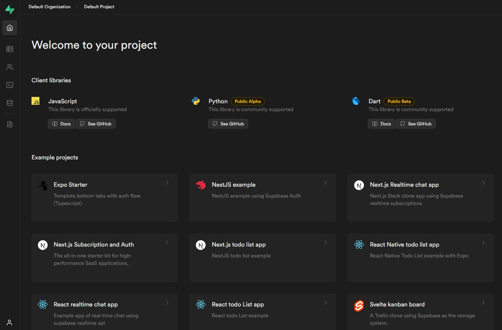

# Supabase CI/CD pipeline

Deploy Supabase on Elestio.

 
 

# Once deployed ...

You can open Supabase Studio here:

    https://[CI_CD_DOMAIN]:27443/
    Login: root (set in reverse proxy)
    password: [ADMIN_PASSWORD] (set in reverse proxy)

The rest API is available here:

    Base URL: https://[CI_CD_DOMAIN]
    REST API URL: https://[CI_CD_DOMAIN]/rest/v1/

You can deploy multiple instances of Supabase to the same CI/CD target, each instance is a different app with different credentials

# Documentation

    https://supabase.com/docs/guides/api

# Edge Functions

To add a new edge function, go to the VM and create a new folder inside volumes/functions and create a file `index.ts`

You can try it both post and get examples here:

## POST

    curl  -X POST \
        'https://[CI_CD_DOMAIN]/functions/v1/hello' \
        --header 'Accept: */*' \
        --header 'Content-Type: application/json' \
        --data-raw '{
        "name":"root"

}'

## GET

    curl https://supabasedfd-u353.vm.elestio.app/functions/v1/hello

# Edge documentation

    https://supabase.com/docs/guides/functions
